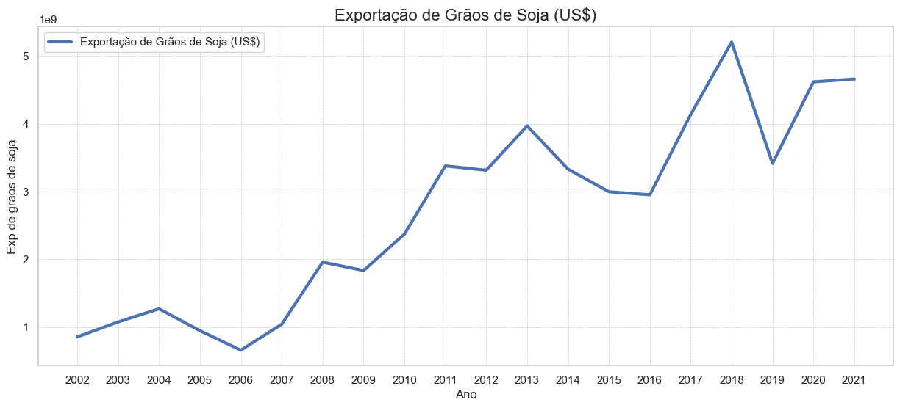
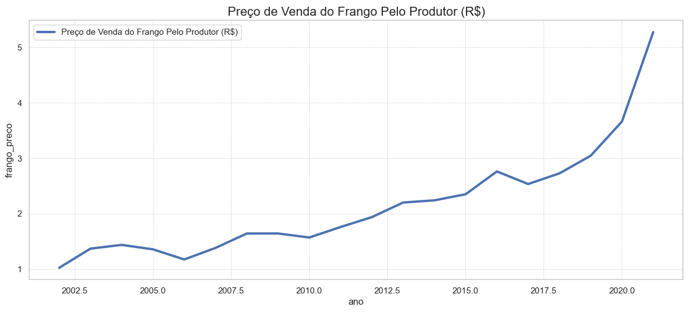
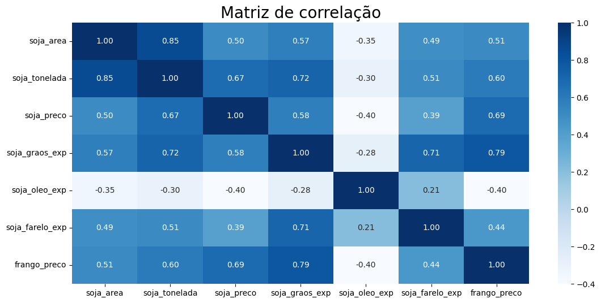
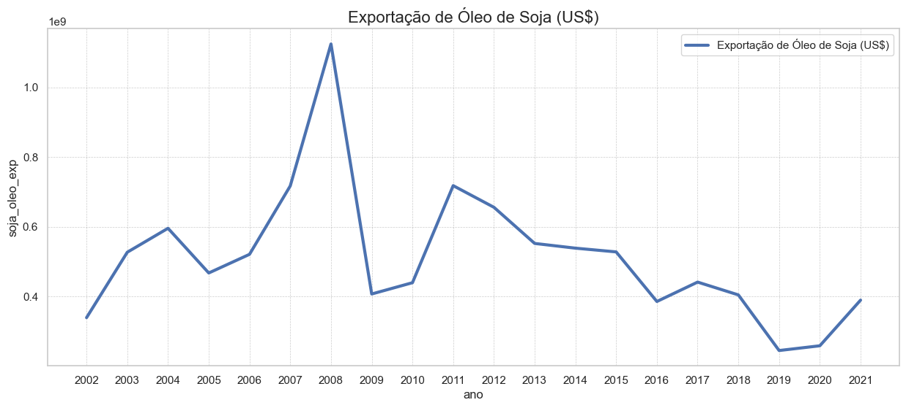

# Elasticidade Preço de Venda do Frango Pelos Produtores

### 0 Sobre o estudo

Este estudo foi desenvolvido com o objetivo de aprimorar continuamente minhas habilidades em análise econômica, adquiridas ao longo da graduação em Economia, e de consolidar práticas no uso de ferramentas para manipulação de dados. O projeto apresenta a aplicação de métodos econométricos e técnicas de programação para análise de elasticidade preço. O código-fonte do trabalho está disponível na pasta notebook, e a documentação do estudo foi organizada em seções, seguindo as normas da ABNT.

### 1 Introdução

A relação entre o mercado de exportação de soja e os custos de produção de frango é um tema relevante para a economia agrícola, dada a importância desses produtos no agronegócio brasileiro. A soja desempenha um papel central na formulação de rações para aves, sendo um insumo fundamental para a produção de frango. O aumento das exportações de soja, impulsionado pela alta demanda internacional, pode resultar em uma redução na disponibilidade do grão no mercado interno, gerando pressões nos custos de produção dos agricultores e refletindo no preço de venda do frango.

Neste estudo, utilizamos uma abordagem econométrica para investigar como as variações nas exportações de soja impactam os preços de venda do frango pelos produtores. Essa análise fornece insights importantes sobre a elasticidade preço, uma métrica que descreve a sensibilidade da variável dependente (preço do frango) às variações em uma variável independente (exportação de soja). A metodologia aplicada permite compreender como a dinâmica do mercado externo influencia os produtores domésticos e o mercado interno.

### 2 Objetivo

O objetivo deste estudo é mensurar a elasticidade preço de venda do frango em relação ao aumento das exportações de soja pelos produtores brasileiros. Por meio de um modelo econométrico log-log, buscamos identificar e quantificar a relação positiva entre essas variáveis, oferecendo uma interpretação clara de como as mudanças percentuais nas exportações de soja afetam os preços médios de venda do frango.

### 3 Metodologia

##### 3.1 Modelo log-log
Neste estudo, foi utilizado um modelo econométrico de regressão log-linear, também conhecido como modelo log-log. Os coeficientes obtidos representam variações percentuais, indicando como uma mudança percentual em X afeta Y. Como referência teórica, foi utilizado o livro *Econometria Básica* de Gujarati, 5ª edição.

##### 3.2 Base de Dados

- IBGE;
- ComexStata.

Para segmentar os dados de exportação, foi utilizado o mesmo critério dos estudos da Embrapa, onde os códigos do Sistema Harmonizado (SH4), foram:
- **1201:** a descrição do produto exportado é *soja, mesmo triturada* denominado no estudo como **soja em grãos;**
- **1507:** a descrição do produto exportado é *óleo de soja e respectivas frações, mesmo refinados, mas não quimicamente modificados* denominado no estudo como **óleo de soja;**
- **2304:** a descrição do produto exportado é *Tortas e outros resíduos sólidos da extração do óleo de soja* denominado no estudo como **farelo de soja.**

### Resultados

O aumento nas exportações de soja pode reduzir a oferta doméstica de soja disponível para o consumo interno, incluindo a ração para aves. Como o custo da ração é um fator relevante na produção de frango, isso pode elevar os custos de produção e, consequentemente, o preço do frango.

- Para cada aumento de 1% nas exportações de soja (em bilhões de dólares), espera-se que o preço médio de venda do frango pelos agricultores aumente 0,544%.

Os Gráficos 1 e 2 a seguir indicam uma similaridade das duas variáveis, sinalizando a relação positiva obtida pela matriz de correlação (Gráfico 3).

**Gráfico 1 - Exportação de Grãos de Soja em Bilhões de Dólares**

**Gráfico 2 - Preço de Venda do Frango Pelo Produtor em Reais**

**Gráfico 3 - Matriz de Correlação de Algumas Variáveis Analisadas**

# Recomendação de Continuação do Estudo
A matriz de correlação revelou uma informação importante: enquanto as exportações de grãos de soja no Brasil têm aumentado durante o período analisado, as exportações de óleo de soja apresentam uma tendência de queda desde 2008.

**Gráfico 4 - Exportações de Óleo de Soja em Bilhões de Dólares**

Com base na série histórica, a partir de 2002, quando ocorre a transição do poder executivo e o presidente se compromete a manter as políticas econômicas do governo anterior, com ênfase no tripé econômico, as exportações de commodities começam a crescer, beneficiando o agronegócio brasileiro com os altos preços dessas commodities. Como ilustrado no Gráfico 4, o valor das exportações de óleo de soja, impulsionado pelo aumento da produção de soja decorrente do boom das commodities, apresenta um crescimento significativo, alcançando seu pico em 2008. A acentuada queda nas exportações em 2009 pode ser atribuída à crise da bolha do mercado imobiliário nos Estados Unidos, que impactou o mercado financeiro global e afetou parceiros comerciais importantes do Brasil, como a China. No entanto, as políticas anticíclicas adotadas nesse período foram direcionadas à recuperação das exportações até 2011, quando essas começaram a diminuir marjoritariamente até o final do período observado, em 2021. Com os dados obtidos neste estudo, recomenda-se a continuação da pesquisa tendo como foco o motivo da redução das exportações do óleo de soja por um período tão longo.

